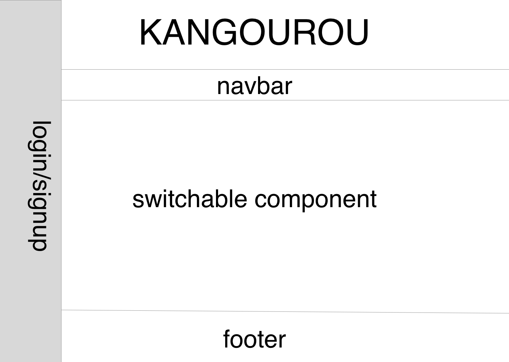
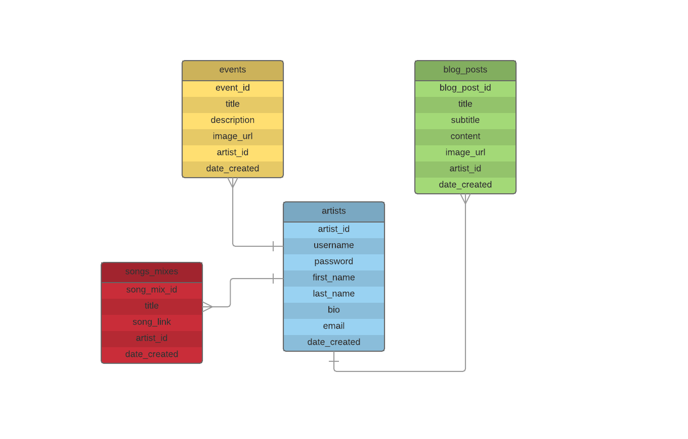

# kollectiv
## Concept
For some time now, I've been wanting to start a musical collective/brand of NYC DJs/Music Producers with a common interest in sharing their work and throwing recurring events in the NYC area. Just great music, a thriving community, and the chance for local artists to share their work/gigs with local music lovers desperate to find new music. In addition to sharing their work/gigs, I also wanted to allow each artist to have their own personal blog which would feed into a larger blog for the entire website which could be about almost anything but primarily focus on music, whether they be album reviews, artist recommendations, reviews of the vast collection of venues in NYC, djing tips, production tips, anything related to music!!!

## Technology
- HTML
- CSS
- Javascript
- PostgresQL
- Node.js
- Express
- React

### Instructions
1. Download zip file. 
2. In your terminal, run "npm install"
3. In your terminal, run "npm start" to run the backend server.
    - You will need to create a .env file in the main directory.

### User Story
On the main website, users will be able to view the website's blog content, events being thrown by the entire collektive, and links to artist profiles. On the second level within each artist profile, users will be able to view the artist's individual contributions to the larger blog, their own personal gigs that are unaffiliated/unrelated to the collektive, a short bio, and original tracks and mixes that the artist has chosen to share. Contact info will also be allowed here.

### Artist Story
Artists will have a login, and will be able to post/modify the content that will make up the entire site. They will be able to have "admin" privileges to their section of the site, which will allow them to completely have CRUD functionality over their artist profile which will include their:
- blog posts
- music
- gig info

### Wireframes

### ERD

### Project Time Frame Given: 12/6-12/15
#### 12/6-12/8
Awaiting approval.
Drawing up wireframes and thinking of UX design choices.
Brainstorming desired functionalities and easiest ways to accomplish them using known technologies. (Simplifying is key!)
Drawing out ERDs. 
#### 12/8-12/10
Setting up entire backend API which will hold artists logins and all of the the tables that will hold website's content.
Setting up models and controllers/routes to communicate with backend API. 
Have an entirely functional CRUD API for every single piece of data by the end of this block. 
#### 12/10-12/12
Starting React front-end skeleton and learning react-router for implementation.
Considering socket-io but leaning more towards seeing it as unnecessary for this website concept. 
Have a fully functional front-end, nav system working by this point. 
Starting main css design and staying consistent in design across ALL pages.
#### 12/12-12/14
Starting to connect front-end and back-end together, and making sure everything is working as planned. 
Working out any issues that might be interfering with website's functionality and/or user/artist story.
#### 12/14-12/15
Adding last minute CSS-touches and preparing presentation. 
Testing functionality across devices and screen sizes.
Checking media queries and ways to break the site with reloads, back loads, front loads, and fast recurring event listeners.

### Key Challenges (and Proof of Concept)
- Time! ⏳ 
- Learning react-router
- Learning JSON Web Token implementation for artists.
- Good CSS design

### Sources
- Scripts/Webpack = Jason Seminara for General Assembly
- Taken from General Assembly template for user auth project 2.
- Daniel Pease's JWT-BCrypt Tutorial
- https://github.com/balloob/react-sidebar

